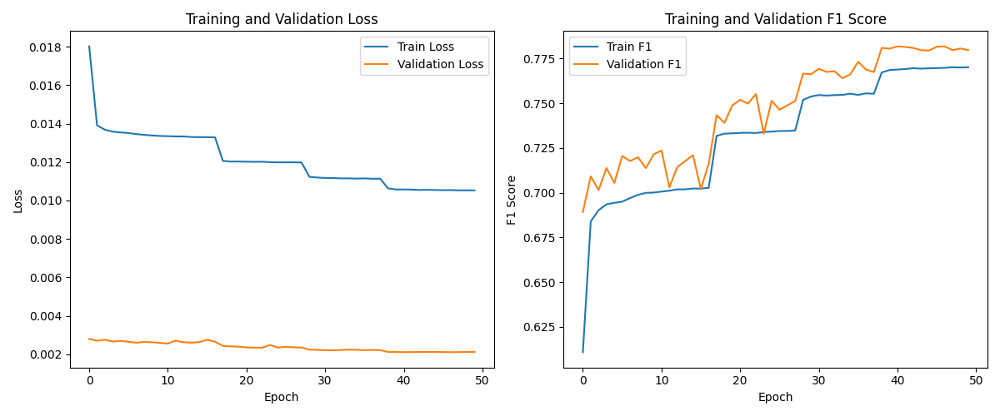
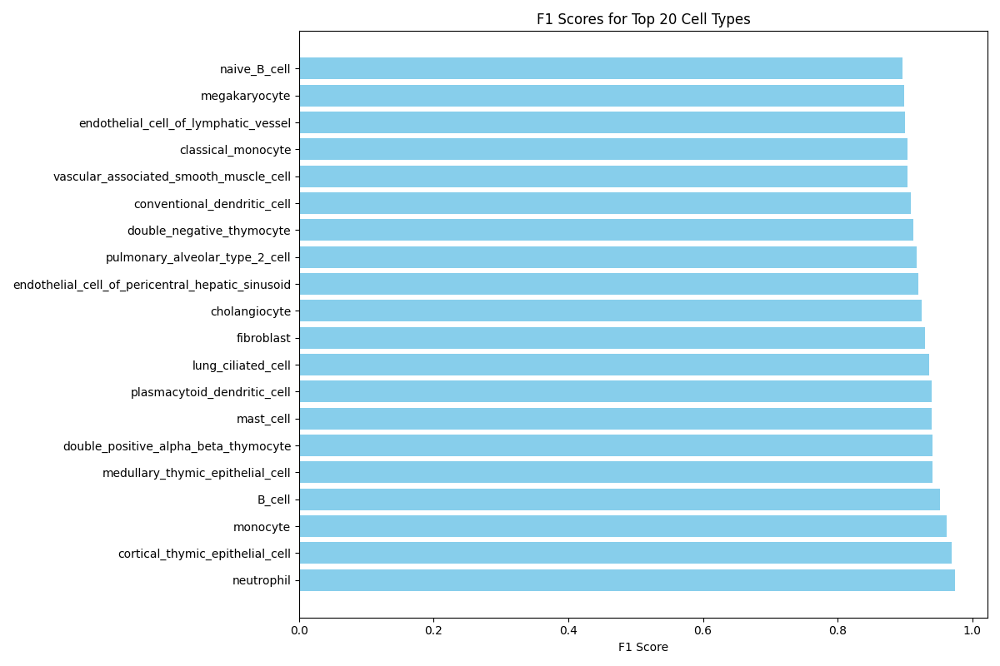

# Spoticell

<div align="center">
    
</div>

## Overview
Spoticell is a deep learning framework for single-cell RNA sequencing (scRNA-seq) data analysis, inspired by audio fingerprinting technology like Shazam. It transforms gene expression profiles into visual representations for rapid and accurate cell type classification, creating a "cell fingerprint" that enables efficient identification even with incomplete expression data.

**⚠️ Note: This project is a work-in-progress. Current results are promising, but development is ongoing.**

## Motivation
Single-cell RNA sequencing has revolutionized our understanding of cellular heterogeneity, but cell type identification remains challenging due to technical noise, biological variation, and the high dimensionality of expression data. Spoticell addresses these challenges by:

1. Transforming high-dimensional gene expression data into 2D spatial matrices where each gene occupies a fixed position
2. Leveraging both CNN and transformer architectures to capture spatial patterns and gene relationships
3. Creating compact fingerprint vectors for efficient cell type matching
4. Enabling rapid classification even with incomplete gene expression profiles

## Method
The Spoticell approach involves:

1. **Data Preprocessing**: Converting gene expression profiles from multiple scRNA-seq datasets into standardized matrices
2. **Spatial Encoding**: Mapping ~20,000 genes to fixed positions in a 2D matrix (typically 155×155)
3. **Dual-Path Architecture**: 
   - CNN path processes spatial patterns in the expression matrices
   - Transformer path captures gene relationships independent of position
4. **Cell Type Classification**: Multi-label classification system for comprehensive cell type identification

<div align="center">
    
    <p><em>Training progress showing continuous improvement in model performance</em></p>
</div>

## Data
The current implementation uses multiple public datasets from the Cell xGene Census, including:
- Human hematopoietic precursor cells (516,121 cells)
- Lung tissue (318,426 cells)
- Liver tissue (259,678 cells)
- Peripheral blood mononuclear cells (PBMCs) (422,220 cells)
- Thymic development data (255,901 cells)
- Tumor microenvironment atlas (391,963 cells)
- Blood cells (335,916 cells)

After filtering for normal tissue and specific cell types of interest, the final training dataset includes approximately ~2,460,000 cells across multiple tissues, representing over 68 distinct cell types. This provides a comprehensive training dataset for robust cell type identification.

## Model Architecture
Spoticell uses a novel dual-path architecture:

1. **CNN Path**:
   - Multiple convolutional blocks with residual connections
   - Processes spatial patterns in gene expression matrices
   - Captures local gene expression relationships
   - Architecture: 4 convolutional blocks with increasing channel dimensions (16→32→64→128)
   - Each block includes batch normalization, ReLU activation, and residual connections

2. **Transformer Path**:
   - Processes gene expression values as a sequence
   - Self-attention mechanisms capture global gene relationships
   - Position-independent processing of gene interactions
   - Parameters: 4 attention heads, 1 transformer layer, 128-dimensional embeddings
   - Includes positional encoding for maintaining spatial context

3. **Fusion Layer**:
   - Combines features from both paths (256-dimensional concatenated vector)
   - Multi-layer perceptron with dimensions 256→128→64
   - Dropout rate of 0.1 for regularization
   - Produces final cell type probability distribution

The complete model has approximately 2.3 million trainable parameters, making it lightweight enough for deployment while maintaining high accuracy.

## Current Results (Spoticell Test)
The initial test implementation achieves:
- F1 Score: 0.78 on validation data
- Precision: 0.80+
- Recall: 0.76+
- Training time: ~24 hours on a single NVIDIA RTX 3090

The model was trained with the following hyperparameters:
- Batch size: 16
- Learning rate: 0.001 with ReduceLROnPlateau scheduling
- Weight decay: 1e-5
- Optimizer: Adam
- Loss function: Binary Cross-Entropy with hierarchical consistency regularization
- Early stopping patience: 10 epochs

These metrics demonstrate Spoticell's ability to correctly identify diverse cell types across multiple tissues, even with technical variation in the data.

<div align="center">
    
    <p><em>F1 scores for top-performing cell type categories</em></p>
</div>

## Installation

```bash
# Clone the repository
git clone https://github.com/elilat/spoticell.git
cd spoticell

# Create and activate a conda environment
conda create -n spoticell python=3.8
conda activate spoticell

# Install dependencies
pip install -r requirements.txt
```

## Usage

### Data Preprocessing
```bash
python src/preprocessing.py --output_dir data/processed
```

### Model Training
```bash
python src/train_model.py --data_dir data/processed --output_dir models/spoticell_test
```

### Cell Type Prediction
```bash
python src/predict.py --model_path models/spoticell_test/best_model_f1.pt --data_path data/test_data.h5ad
```

## Project Structure
```
spoticell/
├── assets/                  # Images and graphics
├── data/                    # Data storage
│   ├── raw/                 # Raw h5ad files
│   └── processed/           # Processed datasets
├── models/                  # Trained models
│   └── spoticell_test/      # Initial test model
│       ├── logs/            # Training logs
│       ├── best_model_f1.pt # Best model checkpoint
│       └── ...              # Training metrics and visualizations
├── notebooks/               # Jupyter notebooks for exploration
├── src/                     # Source code
│   ├── preprocessing.py     # Data preprocessing pipeline
│   ├── train_model.py       # Model training code
│   └── predict.py           # Prediction utilities
├── .gitignore               # Git ignore file
├── requirements.txt         # Project dependencies
└── README.md                # Project documentation
```

## Future Work
- [ ] Expand dataset with additional cell types and tissues
- [ ] Optimize model architecture for faster inference
- [ ] Develop a web interface for easy cell type identification


## License
This project is licensed under the MIT License.

## Acknowledgements
- The Human Cell Atlas project for providing comprehensive reference data
- The Cell xGene Census for making single-cell datasets accessible
- The open-source community for developing tools that enable this research